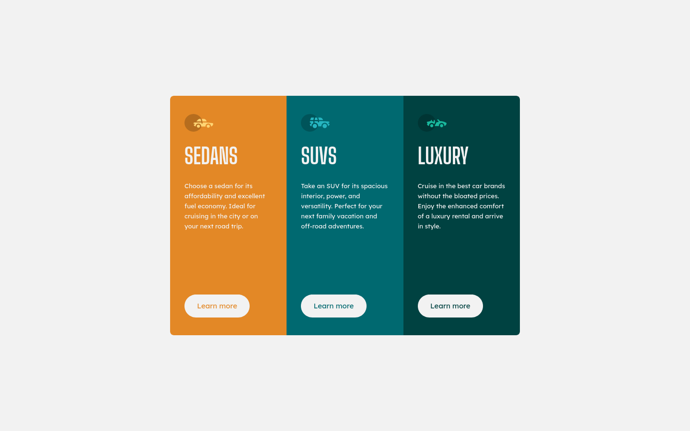

# Frontend Mentor - 3-Column Preview Card component solution

This is a solution to the [3-Column Preview Card component challenge on Frontend Mentor](https://www.frontendmentor.io/challenges/3column-preview-card-component-pH92eAR2-). Frontend Mentor challenges help you improve your coding skills by building realistic projects.

## Table of contents

- [Overview](#overview)
  - [The challenge](#the-challenge)
  - [Screenshot](#screenshot)
  - [Links](#links)
- [My process](#my-process)
  - [Built with](#built-with)
  - [What I learned](#what-i-learned)
- [Author](#author)

**Note: Delete this note and update the table of contents based on what sections you keep.**

## Overview

### The challenge

Users should be able to:

- View the optimal layout depending on their device's screen size
- See hover states for interactive elements

### Screenshot



### Links

- Solution URL: [Add solution URL here](https://your-solution-url.com)
- Live Site URL: [Add live site URL here](https://your-live-site-url.com)

## My process

### Built with

- Semantic HTML5 markup
- Flexbox
- CSS Grid

### What I learned

```css
.p {
  /* Use the remaining space on a parent with justify-content: space-between; */
  flex: 1;
}
```

## Author

- Github - [@johnv2309](https://github.com/johnv2309)
- Frontend Mentor - [@johnv2309](https://www.frontendmentor.io/profile/johnv2309)
